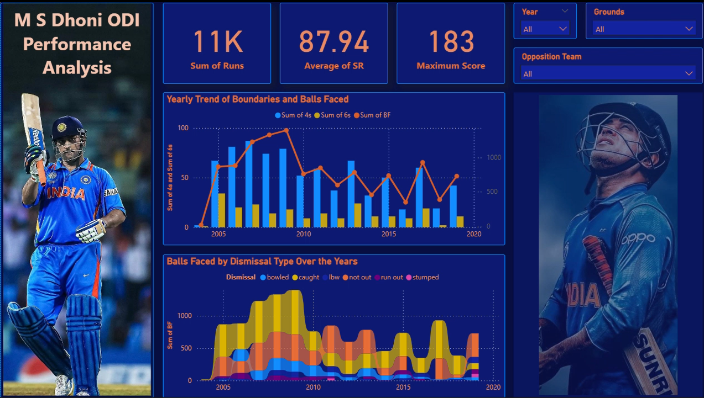

# 🏏 MS Dhoni ODI Performance Analysis Dashboard

## 📊 Project Overview
This Power BI project focuses on analyzing the **One Day International (ODI) performance** of the legendary cricketer **M.S. Dhoni**. The dashboard visualizes his runs, strike rate, dismissals, and consistency throughout his ODI career.

Through this analysis, we can observe trends in Dhoni’s batting performance, how his playing style evolved over the years, and his impact in different match conditions.

---

## 🎯 Objectives
- Analyze **total runs**, **strike rate**, and **highest score** over Dhoni’s ODI career.  
- Visualize **yearly boundaries (4s & 6s)** and **balls faced** trends.  
- Examine **dismissal types** (caught, bowled, lbw, not out, etc.) over the years.  
- Identify Dhoni’s **consistency and finishing ability**.

---

## 🧠 Key Insights
- **Total Runs:** 11K+ across ODI career.  
- **Average Strike Rate:** 87.94, showing his explosive yet composed style.  
- **Highest Score:** 183*, one of the most iconic ODI innings.  
- The **2008–2013 period** showcases peak boundary and performance trends.  
- Dhoni’s **"Not Out" innings** frequency highlights his legendary finishing skills.  
- The stacked dismissal chart reveals that he was often **caught or not out**, showing reliability and maturity as a finisher.

---

## 🎥 Dashboard Preview
Check out the interactive dashboard walkthrough below 👇

[Dashboard Working Video](https://github.com/Gayathri1003/MS-Dhoni-ODI-Stats/blob/main/Dhoni.mp4)

---

## 🛠️ Tools Used
- **Power BI** – For data visualization and dashboard design  
- **Excel** – Data cleaning and preparation  
- **Canva / Photoshop** – For background design and visual theme  

---

## 🏁 Conclusion
The dashboard highlights the consistency and brilliance of M.S. Dhoni as a cricketer — a true finisher who contributed immensely to Indian cricket through stability, leadership, and match awareness.
